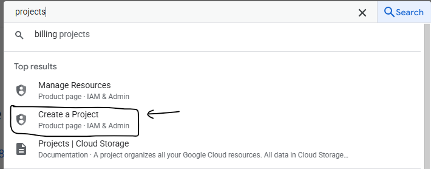
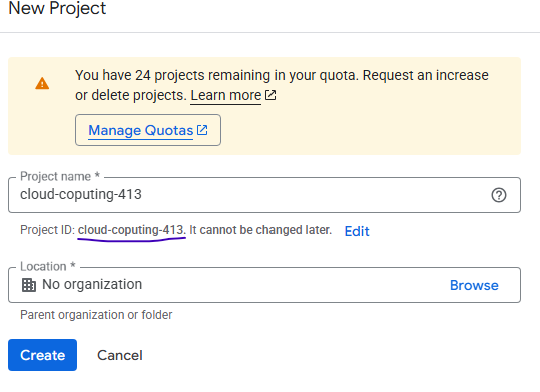
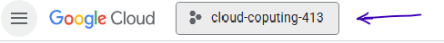
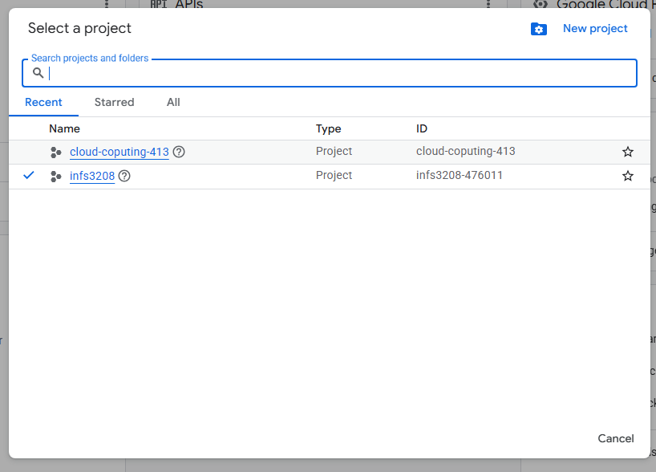

# RouteGate Web Application - INFS32308 Project

RouteGate is a flight planning and weather assessment system designed to help aviation professionists and airport air control staff to make critical decisions about flight operations.

## Set up guide

This file aims to provide a step-by-step instruction for deploying RouteGate from your Google Cloud Platform (GCP) Shell. The entire process can take aproximately 10-20 minutes to be completed.

#### Prerequisites

Before beginig the set up process, you must have:

- google account to access GCP
- valid credit amount for GCP billing verification (**_you need to have billing credits in you account in order to set up RouteGate_**)

#### Step 1 - Create a Google Cloud Platform Project

A GCP project serves as an organizational container for all your cloud resources. Follow these steps to create a new project:

1. Navigate to Google Cloud Console in your browser (https://console.cloud.google.com)
2. Sign in with your Google account (accept term and conditions)
3. In the top search bar type "Projects" and then click on "**Create a Project"**
   
4. Give the project a name and copy the project ID somewhere (you will need that later)
   
5. Click on create and wait for the project to be created
6. Click on the project button and select your newly created project
   
   

#### Step 2 - Open Google Cloud Shell

1. Locate the cloud shell icon in the top-right corner of the GCC (look for the icon `>_`). Once found, click on it and authorize the access.
2. Wait for the shell to be ready. Once ready, you will see this :

```
gcloud config get-value project
```

3. Verify your project by running this command :

```
gcloud config get-value project
```

This command should display your Project ID (check it with the ID copied from step 1). If you see another ID, change to your project by running this command

```
gcloud config set project YOUR_PROJECT_ID
```

#### Step 3 - Clone the RouteGate repository

1. Navigate to home directory with `cd ~`
2. Clone the repository using the command :

```
git clone https://github.com/Adel13Lis/INFS3208-ROUTEGATE.git
```

This will create a new directory INFS3208-ROUTEGATE containing all the project files.

3. Navigate to the project directory with `cd INFS3208-ROUTEGATE`

#### Step 4 - Run the Complete Setup Script

RouteGate contains a setup script (`setup.sh`) that automates the entire deployment process. This script creates the Kubernetes cluster, build Docker images, push them to Container Registry, and deploy all application components.

1. Set the GCP Project ID Environment Variable by running the command :

```
export GCP_PROJECT_ID=$(gcloud config get-value project)
```

You can verify that the command run correctly if the following like returns your project ID : `echo $GCP_PROJECT_ID`

2. Make the all the scripts executable :

```
chmod +x ./*.sh
```

3. Run the setup script :

```
./setup.sh
```

Confirm the cluster configuration by clicking `y` (or click `n` and set your own configurations).

4. Wait for the setup to be completed. This process might table up to 15 minutes. In this step three main things are happening:

   - The GKE Cluster is created
   - The Docker Images are built
   - Kubernetes are deployed

5. When the script finished you will see some access information that look like this :

```
========================================
Setup Complete!
========================================

Frontend URL: http://XX.XX.XX.XX
API URL: http://YY.YY.YY.YY:5000

Demo Credentials:
  Email: demo@routegate.com
  Password: demo123
```

These information contains the public IP address where you can access the RouteGate application, and some demo credentials that you can use to access a set up account for test and presentation purposes.

If you do not see the public IP, or you need to retireve it afterwords, you can run the following command which will return you the public IP :

```
kubectl get service frontend -o jsonpath='{.status.loadBalancer.ingress[0].ip}'
```

#### Step 5 - (Optional) Clean up and delete GKE

I have also written a script that clean up all the recources and deletes the kubernete cluster. I have decided to write this script in order to avoid unnecessary GCP charges.

Tu 'uninstall' RouteGate, navigate to the INFS3208-ROUTEGATE folder and run the following command :

```
cd ~/INFS3208-ROUTEGATE
./cleanup.sh
```

Here you need to confirm the deletion.

Wait for the process to be completed (can take up to 10 minutes).
